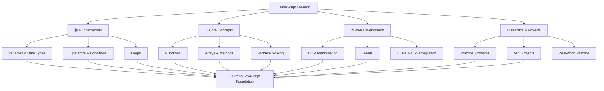

# 🚀 JavaScript Learning Journey

Welcome to my JavaScript repository!  
This repo contains my complete learning journey of JavaScript — from basics to advanced concepts, along with practice problems and mini projects.

---

## 🔀 Learning Journey

---

## 📂 Folder Structure
javascript/
│
├── Basics/
├── Arrays/
├── Functions/
├── DOM/
├── Projects/
└── README.md

---

## 📌 Topics Covered

- ✅ Variables & Data Types  
- ✅ Operators & Conditions  
- ✅ Loops  
- ✅ Functions  
- ✅ Arrays & Methods  
- ✅ DOM Manipulation  
- ✅ Events  
- ✅ Problem Solving  
- ✅ Mini Projects  

---

## 🔥 Features of This Repo

- Beginner-friendly code 🧠  
- Clean and readable examples ✨  
- Practice-based learning 📚  
- Real-world mini projects 💡  

---

## 🎯 Goal

To become strong in JavaScript by:
- Practicing daily  
- Building projects  
- Understanding core concepts deeply  

---

## 🛠️ Tech Used

- JavaScript (ES6+)  
- HTML  
- CSS  

---

## 📈 Progress

🚧 Currently learning and updating regularly...

---

## 🤝 Contribution

This is a personal learning repo, but suggestions are always welcome!

---

## ⭐ Support

If you find this helpful, give it a ⭐ on GitHub!

---

## 📬 Connect with Me

- GitHub: (https://github.com/sumitkumar2374)

---

> 💡 *“Consistency beats talent when talent doesn’t work hard.”*

---

> Author 

**Sumit Kumar**
 
